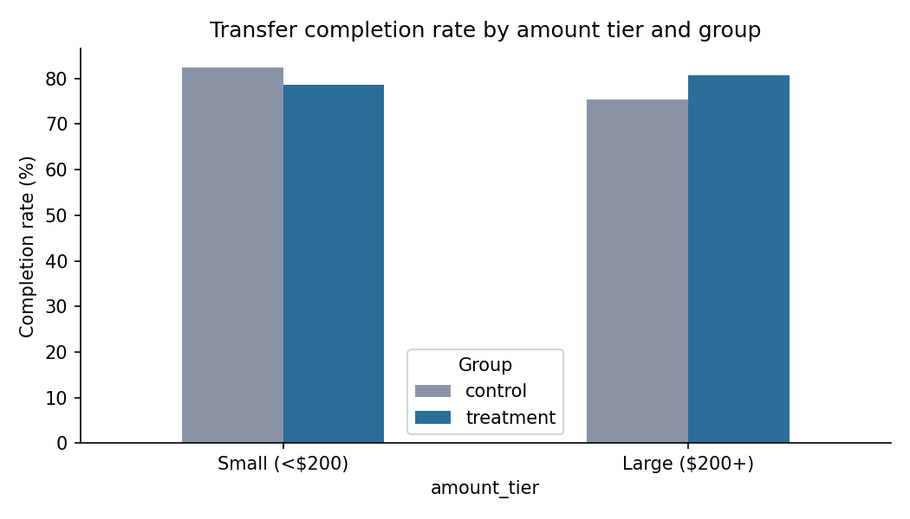
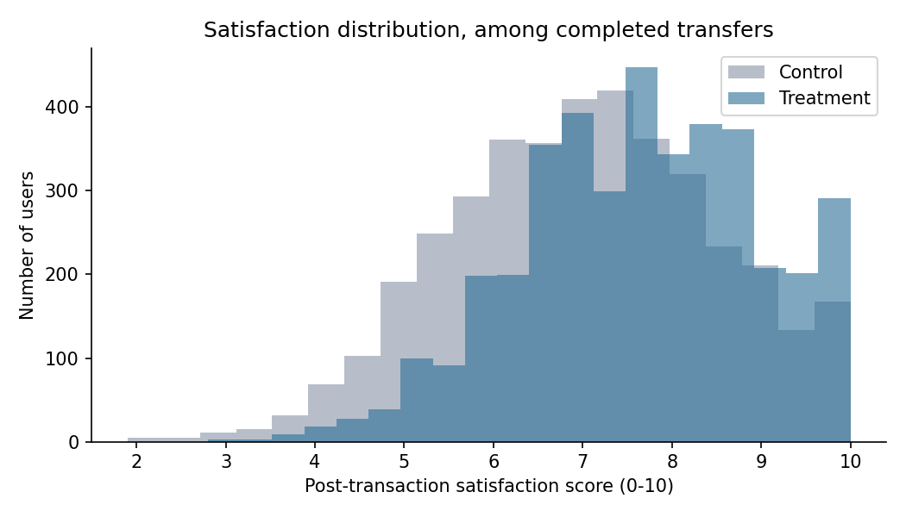

# A/B Testing Experiment Analysis: Fee & Exchange Rate Transparency


## Overview

This project is an A/B test that looks at a real business question: does
showing the full fee and exchange rate breakdown on an international
transfer change user behavior, compared to only showing the final amount
received. The project includes checks to make sure the experiment is
valid, the main result, a segment analysis that actually reverses the main
result (a Simpson's paradox pattern), and guardrail metrics that help
decide the final recommendation.

All the data used here is synthetic. I generated it to look like a
realistic fintech remittance scenario, without using any real company or
user data.

## Experiment design

- **Control (A):** only the final amount received is shown
- **Treatment (B):** full breakdown shown (amount sent, exchange rate
  applied, fee, final amount)
- **Primary metric:** transfer completion rate
- **Segment:** transfer amount (small, under $200 vs large, $200 and up)
- **Guardrail metrics:** post transaction satisfaction score (0 to 10) and
  30 day repeat transfer rate
- **Randomization:** 50/50 split, around 5,000 transfers per group
- **Duration:** 4 weeks
- **Significance level:** 5%, two sided, decided before looking at the
  results. I also decided the transfer size segment in advance, because a
  fee matters more, relatively, on a small transfer than on a large one

## Features

- Sample Ratio Mismatch (SRM) check before trusting the results
- Overall two proportion z test for the primary metric
- Segment analysis by transfer size, decided before running the test,
  showing that the overall result was hiding two real, opposite effects
  (a classic Simpson's paradox pattern)
- Guardrail metric analysis (satisfaction, repeat usage) to check if
  focusing only on the primary metric would have led to the wrong
  decision
- A short discussion of the difference between statistical significance
  and practical significance, and why deciding the segment in advance
  matters (to avoid p hacking)

## Technologies

- Python (pandas, numpy)
- SciPy and statsmodels for hypothesis testing
- Matplotlib for visualization
- Jupyter Notebook

## Workflow

- Simulate a realistic dataset for the experiment
  (`data/fee_transparency_ab_test_data.csv`)
- Load and inspect the data, checking for data quality issues
- Check the sample split for Sample Ratio Mismatch
- Calculate the overall completion rate and run the main hypothesis test
- Break the result down by transfer size and run the test again for each
  segment
- Look at the guardrail metrics (satisfaction, 30 day repeat rate)
- Turn the results into a business recommendation, including what it
  would take to keep the benefits without the small transfer cost

## Results

- **Overall result:** 78.9% (control) vs 79.6% (treatment), not
  statistically significant (p = 0.24). If you only look at this number,
  you would say the treatment made no difference.
- **By transfer size:** small transfers drop by 3.9 percentage points
  with the transparency treatment (statistically significant), large
  transfers gain 5.3 percentage points (also statistically significant).
  The overall number was hiding these two opposite effects.
- **Guardrail metrics:** both satisfaction and 30 day repeat rate improve
  clearly with the transparency treatment, for both small and large
  transfers.
- **Recommendation:** launch the transparency treatment, but treat the
  drop in small transfers as a real cost that deserves a follow up test
  (for example, a lighter version of the breakdown for small transfers).
  Keep monitoring results by segment after launch, not only the overall
  number.

  
  

## Project Purpose

The goal of this project was to show A/B test analysis that goes beyond
just reading one p value. This means checking if the experiment is valid
first, understanding why you should decide a segment split in advance
instead of looking for one after seeing the data, and using guardrail
metrics to catch cases where the primary metric alone would lead to the
wrong decision.

## Repository Contents
```
├── data
│   ├── fee_transparency_ab_test_data.csv
│   └── README.md
│
├── notebooks
│   ├── AB_Test_Fee_Transparency.ipynb
│   └── README.md
│
├── images
│   ├── segment_reversal.png
│   └── satisfaction_distribution.png
│
└── README.md
```
 
## Author

Jorge Lozano


